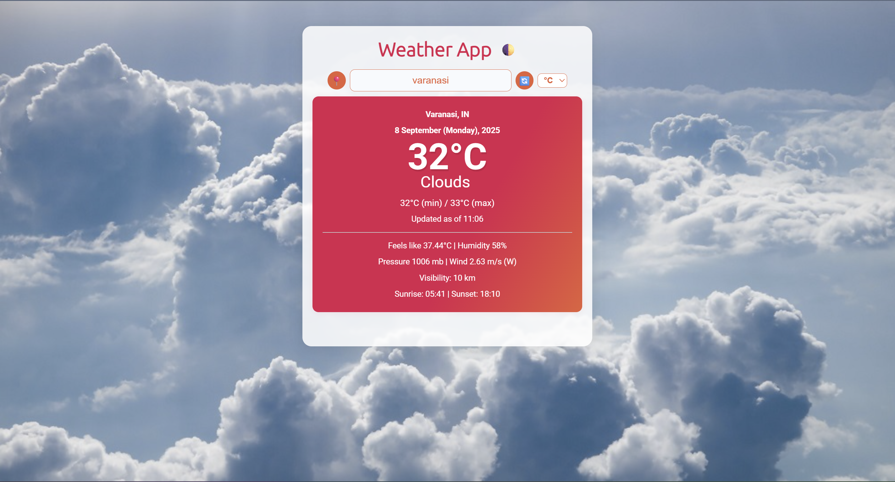

#
# ## Screenshot

# 

**Live Demo:** [https://68b530a9f002a9a414bf6070--weather-app-soum.netlify.app/](https://68b530a9f002a9a414bf6070--weather-app-soum.netlify.app/)

# Weather Web App

A modern, feature-rich weather application built with HTML, CSS, and JavaScript.

## Features

- **Current Weather:** Get real-time weather for any city or your current location.
- **5-Day Forecast:** View a 5-day weather forecast with daily summaries.
- **Hourly Forecast:** Interactive chart for the next 24 hours (Chart.js).
- **Weather Alerts:** Displays severe weather alerts when available.
- **Map Integration:** See the searched location on an interactive map (Leaflet.js).
- **Animated Weather Effects:** Rain and snow animations for immersive experience.
- **Dynamic Backgrounds:** Beautiful, responsive backgrounds that change with the weather.
- **Dark/Light Mode:** Toggle between dark and light themes.
- **Unit Toggle:** Switch between Celsius and Fahrenheit.
- **Geolocation:** Auto-detects your location for instant weather.
- **General Animations:** Floating clouds and sun rays for a lively UI.
- **PWA:** Installable as a Progressive Web App with offline support.

## Netlify link:
**https://weather-app-soum.netlify.app/**

## How to Use

1. **Open `index.html` in your browser.**
2. Enter a city name or use the location button to get your local weather.
3. Explore the forecast, map, and enjoy the animated effects!

## Customization
- Add your own background images to the `img/` folder for richer visuals.
- Tweak animation styles in `style.css` as desired.

## Tech Stack
- HTML, CSS, JavaScript (Vanilla)
- [OpenWeatherMap API](https://openweathermap.org/api)
- [Leaflet.js](https://leafletjs.com/) for maps
- [Chart.js](https://www.chartjs.org/) for charts
- [Weather Icons](https://erikflowers.github.io/weather-icons/)

## Credits
- Weather data: OpenWeatherMap
- Map tiles: OpenStreetMap & Leaflet
- Icons: Font Awesome, Weather Icons
- Animations: Custom CSS/JS

---

**Enjoy your beautiful, interactive weather app!**

